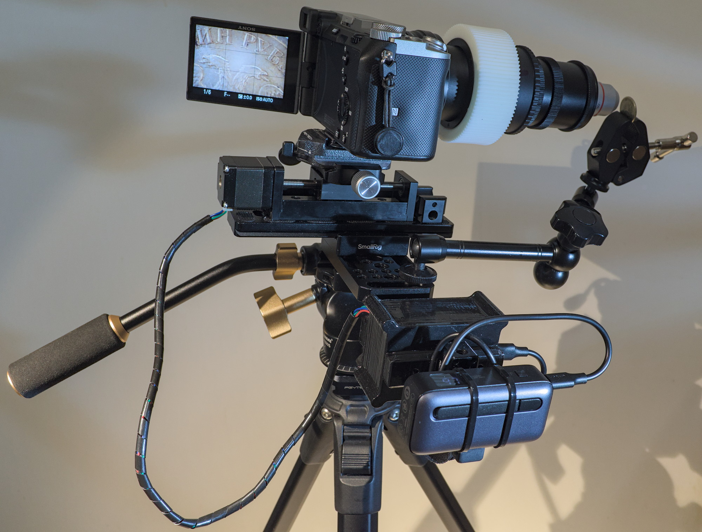
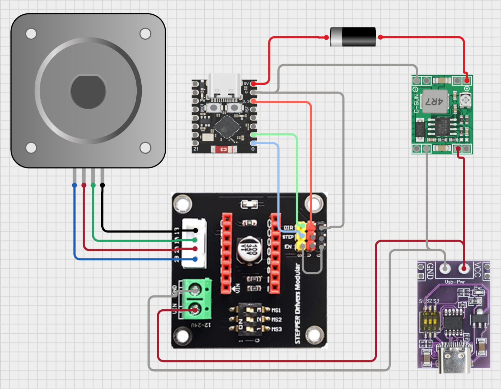
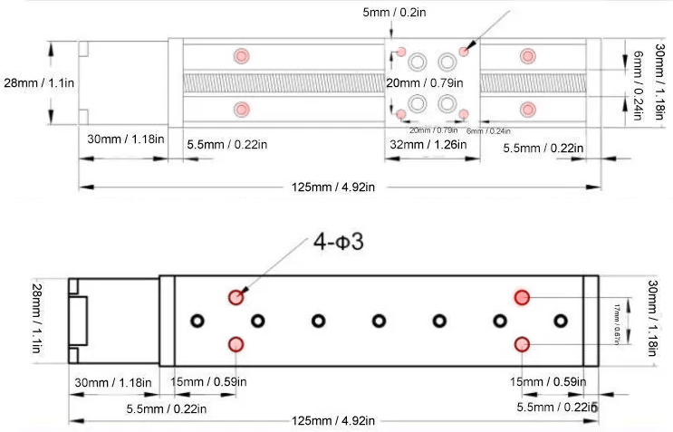
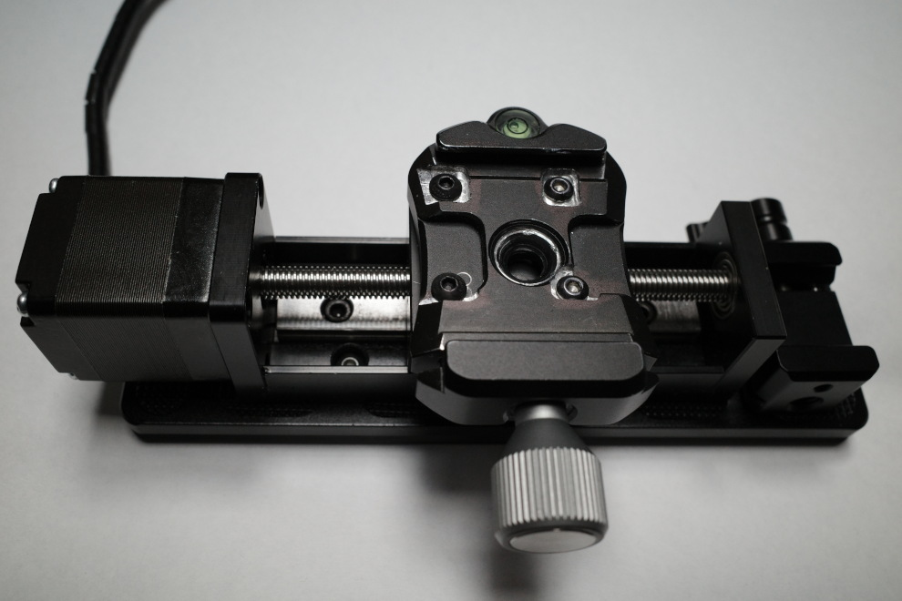
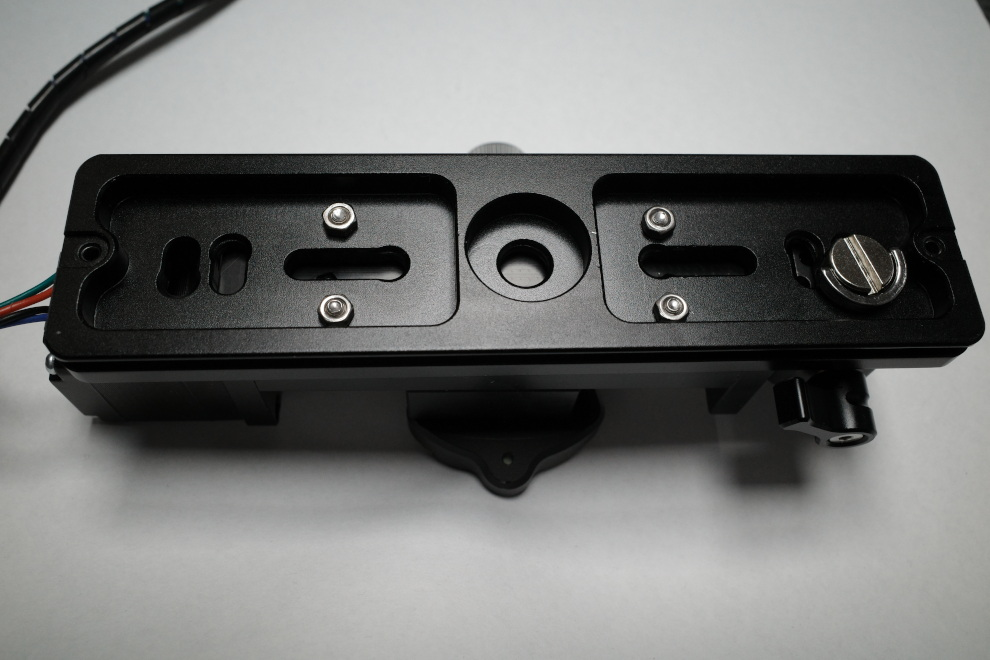
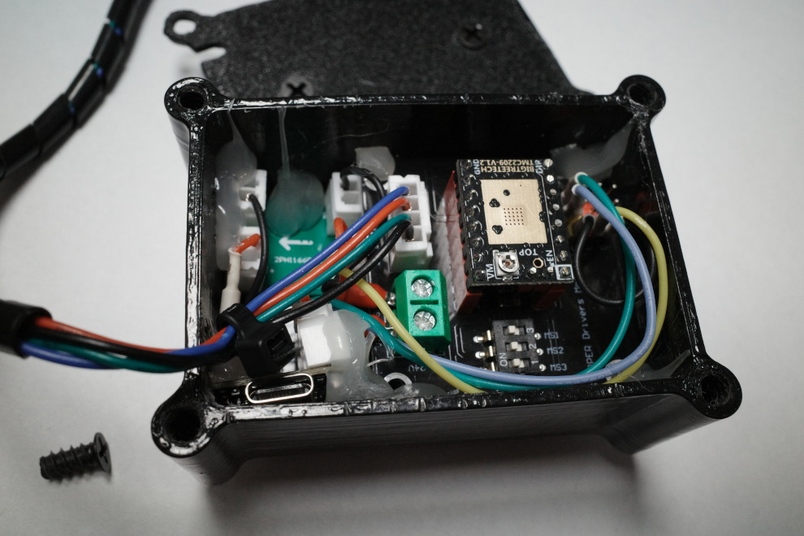
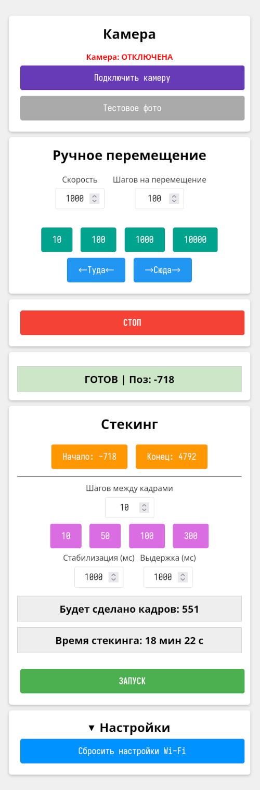

# MacroPribor-32

Это проект по созданию самодельной моторизованной рейки, облегчающей процесс съемки серий кадров для последующего фокус-стекинга.

Моторизованная направляющая перемещается в заданную начальную точку, сдвигает камеру на небольшие расстояния и посылает камере сигналы для съемки по BLE (Bluetooth Low Energy), пока не достигнет заданной конечной точки. Весь процесс контролируется через встроенный в контроллер веб-интерфейс.

В данный момент поддерживаются только камеры Sony, совместимые с пультом RMT-P1BT (например: A7III, A7V, A7C, A6700, A9III и т.д.).

Код для работы с BLE основан на [https://github.com/coral/freemote](https://github.com/coral/freemote) и [https://github.com/dzwiedziu-nkg/esp32-a7iv-rc](https://github.com/dzwiedziu-nkg/esp32-a7iv-rc).

Всё собрано из недорогих и доступных в продаже компонентов. Корпус с электронными модулями напечатан на 3D-принтере, но при желании (и отсутствии 3D-принтера) можно изготовить корпус альтернативными способами или обойтись вообще без него.

Проект в стадии не очень активной разработки. В будущем планируется разработать нормальный дизайн печатной платы и корпуса, добавить совместимость с другими моделями камер (в том числе по проводному разъему для пульта) и не только это.

## Содержание
* [Инструкция по сборке](#инструкция-по-сборке)
    * [Список компонентов](#список-компонентов)
    * [Сборка электроники](#сборка-электроники)
    * [Сборка корпуса и механических частей](#сборка-корпуса-и-механических-частей)
    * [Установка прошивки](#установка-прошивки)
* [Использование](#использование)
    * [Подключение к камере](#подключение-к-камере)
    * [Настройка сети](#настройка-сети)

# Инструкция по сборке

## Список компонентов
<details>
<summary>Примерный список компонентов на Али с ценами на февраль 2026 года (раскрыть картинку)</summary>
Можно уложиться в 5к рублей.


</details>

**Электроника** (сложно сказать, по каким ключевым словам конкретные модули найдутся на маркетплейсе, но вы можете визуально ориентироваться по картинкам):
* [Линейная направляющая](./docs/images/rail.jpg) (актуатор) с шаговым двигателем NEMA11, винтовой передачей и рельсовой направляющей. Можно найти в продаже по запросам: "мини направляющая чпу", "электрическая направляющая оси", "линейная направляющая ось чпу" и т.п. Насколько я понимаю, на них стоит дешевый китайский аналог дорогого китайского двигателя MOON'S LE111S-W0601-50-AR1-S-100.
* ESP32-C3 Super Mini (как на схеме ниже).
* Драйвер шагового двигателя (A4988, DRV8825, TMC2209 и т.п.).
* Плата расширения драйвера шагового двигателя (как на схеме ниже).
* Type-C PD/QC триггер (как на схеме ниже).
* Понижающий DC-DC преобразователь MP1584EN или что-то аналогичное.
* Диод Шоттки 1N5819.
* Провода.
* Набор JST коннекторов и обжимка. Но это не обязательно, можно просто припаять провода к платам.

**Крепежные элементы**:
* [Площадка Arca Swiss PU-150](./docs/images/arcaplate.jpg).
* Зажим Arca Swiss, в котором можно просверлить крепежные отверстия под каретку направляющей (смотри схему с размерами ниже).
* Винты М3 для крепления площадки и зажима Arca Swiss к моторизованной направляющей — 8 штук. Длину нужно подобрать эмпирическим путём.
* Гайки М3 — 4 штуки. Лучше с фланцем, но подойдут и обычные.
* Винты для компьютерных корпусных кулеров для сборки 3D-печатного корпуса — 10 штук.
* Сырная пластина, Magic Arm, зажим для NATO rail и прочие необязательные вещи для удобного крепления.
 
## Сборка электроники

1. Настройте микропереключателями на Type-C PD/QC триггере выходное напряжение в диапазоне от 12В до 20В. Убедитесь, что все нужные блоки питания/зарядные устройства/повербанки выдают нужное напряжение с этими настройками модуля. Некоторые девайсы могут отказаться выдавать определенное напряжение из-за их конструктивных особенностей реализации PD/QC протокола.
2. Подключите выход питания из Type-C триггера ко входу модуля DC-DC преобразователя MP1584EN. 
3. Подайте питание. 
4. Подстроечным резистором настройте на нем выходное напряжение 5В.
5. Отключите питание.
6. Установите драйвер шагового двигателя в плату расширения. Настройте нужные параметры микрошага переключателями на плате расширения. Настройки зависят от модели драйвера, их можно посмотреть в документации драйвера.
7. Замкните перемычкой контакты EN и GND на плате расширения драйвера двигателя.
8. Подключите микроконтроллерный модуль ESP32-C3 к стабилизатору напряжения и драйверу двигателя по схеме.
9. Подключите питание **с отключенным от платы двигателем** и подстроечным резистором на плате драйвера настройте референсное напряжение Vref (напряжение между корпусом подстроечного резистора и GND), соответствующее ограничению тока в 500мА. Ограничение тока вычисляется по формуле из документации, для каждой модели драйвера формула своя. Например, для DRV8825 ``Vref = Current Limit / 2``, т.е. для тока 0.5А значение Vref должно быть 0.25В.
10. Подключите двигатель.

## Сборка корпуса и механических частей
Просверлите отверстия сверлом 3 мм в зажиме и площадке Arca Swiss по размерам со схемы ниже. Прикрутите их к направляющей.


У меня был немного неподходящий зажим. Но он уже был, и его не пришлось покупать специально. Поэтому пришлось доработать фрезером.



Type-C PD/QC триггер жестко фиксируется в корпусе и прикручивается крышкой с четырьмя винтами от корпусных вентиляторов. Дизайн крепления основан на [этой модели](https://www.printables.com/model/928729-pdqcafc-decoy-trigger-module-enclosure). И провода должны быть припаяны к нему [аналогичным образом](./docs/images/typecdecoy.jpg).

В монтажные отверстия на модулях я запаял JST колодки на плату и обжал на проводах JST разъемы. На гребенку платы для драйвера двигателя установил провода с обжатыми контактами от JST под термоусадкой. После укладки плат зафиксировал их термоклеем. Получилось не очень красиво, но приемлемо.



## Установка прошивки
1. Установите PlatformIO и esptool.
2. Отключите питание от Type-C триггера, подключите ESP32-C3 по USB к компьютеру.
3. Можно очистить флеш контроллера:
```bash
pio run --target erase
```
4. В файле ``src/main.cpp`` найдите строку:
```C++
#define CAMERA_NAME "ILCE-7C"  // Имя камеры в Bluetooth меню
```
и замените название модели на вашу.

5. В каталоге со склонированным репозиторием запустите:
```bash
pio run # сборка
pio run --target upload # заливка прошивки
pio run --target uploadfs # заливка файловой системы
```
6. После успешной [настройки сети](#настройка-сети) можно обновлять прошивку по сети через OTA:
```bash
pio run -t clean -e ota
pio run -e ota --target upload
pio run -e ota --target uploadfs
```

# Использование
Интерфейс должен быть интуитивно понятным.



## Подключение к камере

В меню камеры следуйте инструкции по подключению пульта Sony RMT-P1BT.
Когда в камере запустите "Pairing", в веб-интерфейсе нажмите кнопку "Подключить камеру".

## Настройка сети

При первом включении контроллер поднимает точку доступа с названием "MacroPribor-32" и паролем "MacroPribor-32", если в его памяти до этого не были сохранены данные для подключения к точке доступа (обновление прошивки без предварительной полной очистки флеша не очищает настройки Wi-Fi). Подключайтесь к точке доступа "MacroPribor-32", переходите на её Captive portal [http://192.168.4.1](http://192.168.4.1), настраивайте вашу точку доступа.
Контроллер работает только с точками доступа на 2.4 ГГц, в её сети должен быть DHCP сервер, который выдаст IP адрес контроллеру.

Если нужно принудительно сбросить настройки Wi-Fi -- нажмите кнопку "Сбросить настройки Wi-Fi".

